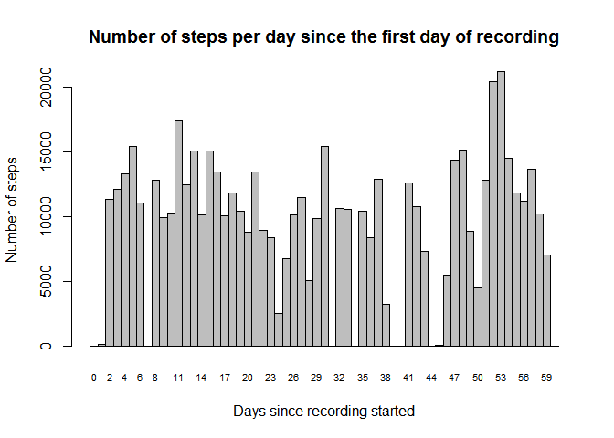
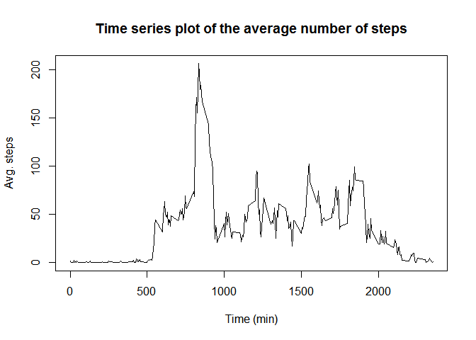
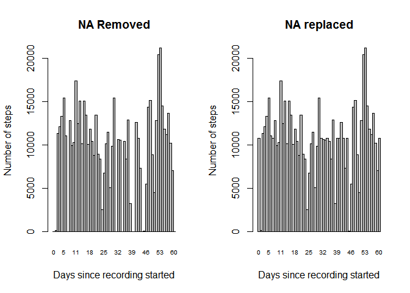
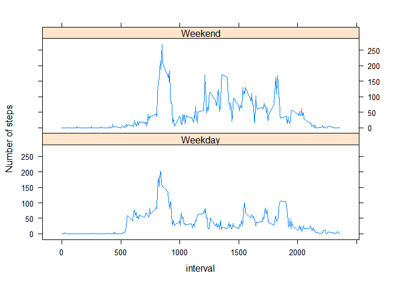

# Reproducible Research: Peer Assessment 1

# Week 18 - Activity Monitoring Analysis
IC

# Pre-analysis Code

Best thing to do first is to install packages you do not have for the analysis. The following code checks if a package is there and then installs the package:


```r
# Always clear global environment
rm(list = ls())

# Check for packages, and install if not there
if(!require(rstudioapi)) install.packages("rstudioapi")
if(!require(dplyr)) install.packages("dplyr")
if(!require(zoo)) install.packages("zoo")
if(!require(tidyr)) install.packages("tidyr")
if(!require(lubridate)) install.packages("lubridate")

# Imports packages
require("rstudioapi")
require("dplyr")
require("zoo")
require("tidyr")
require("lubridate")
```

Next thing to do is to set the working directory:

```r
setwd("~/R/Coursera/Week 18/")
```
Note: This line can be replaced with ```setwd(dirname(rstudioapi::getActiveDocumentContext()$path))``` in RStudio.

# Loading Data

The following is used to load in the data for the analysis:

```r
rawData = read.csv("activity.csv",stringsAsFactors = F) # removes factors which can be annoying for analysis
```

# What is mean total number of steps taken per day?

To calculate the number of steps per day, we can use the dplyr package:

```r
stepsPerDay =   rawData %>%
                group_by(date) %>%
                summarise(Steps = sum(steps,na.rm = T))
```

We can then calculate the days since the first day we started the programme. This removes any dependencies.

```r
# change to date
stepsPerDay$date = date(stepsPerDay$date)

# calculate days since
stepsPerDay$DaysSinceFirst = stepsPerDay$date - min(stepsPerDay$date)
```

We can now plot a histogram of this data to see how the number of steps change over the course of the experiment:

```r
# plot hist using plot
with(stepsPerDay,barplot(Steps,
                         names.arg= DaysSinceFirst, 
                         cex.names = 0.6,
                         xlab = "Days since recording started",
                         ylab = "Number of steps",
                         main = "Number of steps per day since the first day of recording",
                         space = 0))
```

<!-- -->

From this data, we can calculate the mean and median from:

* Mean: 9354
* Median : 10395

# What is the average daily activity pattern?

First thing we have to do is average all the data for the various 5 minute intervals:

```r
# make a dat frame for the 5-min intervals
 intervalSteps =    rawData %>%
                    group_by(interval) %>%
                    summarise(Average = mean(steps,na.rm = T))
```

Next we can plot this data to obtain a useful trend: 

```r
# plot data
with(intervalSteps,plot(interval,Average,
                        type = "l",
                        ylab = "Avg. steps",
                        xlab = "Time (min)",
                        main = "Time series plot of the average number of steps",
                        cex = 0.6))
```

<!-- -->

From this, we can see that most of the activity ranges after the 5 min mark. Using the plot and the data set, we can determine at which time the most steps occur, as well as which 5-minuth interval this occurs at. The following code produces this:


```r
# Max value
maxValue = max(intervalSteps$Average)

# Find the minutes at this maximum
maxMinutes = as.integer(intervalSteps$interval[match(max(intervalSteps$Average),intervalSteps$Average)])

# Which segment. Note that 0-5 is the first, therefore it is +1
maxThTime = (maxMinutes / 5) + 1
```

Therefore, we can conclude that the maximum is 206.17, which occurs at 835 after the recording started, which is the 168*th* 5-minute segment. 

# Imputing missing values

The data set contains various NA values within in. We have to do a count for each column and see how many NA's are in each:


```r
# count number of NA's
stepsNA = sum(is.na(rawData$steps))
dateNA = sum(is.na(rawData$date))
intervalNA = sum(is.na(rawData$interval))
```

From this, we see that dataNA and intervalNA have zero NA values. However, the stepsNA has 2304 NA values. This is about 13 % of values which have no value. The easiest way to correct this is to substitute them with the mean value of that interval (even though this is not recommended). To achieve this, we use the previous data set (intervalSteps). 

First we split the data set into two sets - one with only NA's and one with no NA's:


```r
# split data set
dataNA = rawData[is.na(rawData$steps),]
data = rawData[!is.na(rawData$steps),]
```

Now we can replace the NA values with the means and recombine:

```r
# merge data from previous set
dataNA = merge(dataNA,intervalSteps,by.x = "interval",by.y = "interval", all.x = T)

# make average equal to the value
dataNA$steps = dataNA$Average

# rearrange dataNA
dataNA = dataNA[,c("steps","date","interval")]

# merge data together
data = rbind(data,dataNA)
```

Now follow the same steps and the first analysis (note the NA in the name):

```r
# collapse and count steps per day (dplyr)
stepsPerDayNA =   data %>%
    group_by(date) %>%
    summarise(Steps = sum(steps,na.rm = T))

# change to date
stepsPerDayNA$date = date(stepsPerDayNA$date)

# days since first day
stepsPerDayNA$DaysSinceFirst = stepsPerDayNA$date - min(stepsPerDayNA$date)
```

Now plot the two histgrams side by side and see if the overall shape changed:

```r
par(mfrow = c(1,2))

# plot data with NA removed
with(stepsPerDay,barplot(Steps,
                         names.arg= DaysSinceFirst, 
                         cex.names = 0.6,
                         xlab = "Days since recording started",
                         ylab = "Number of steps",
                         main = "NA Removed",
                         space = 0))

# plot data with NA replaced
with(stepsPerDayNA,barplot(Steps,
                         names.arg= DaysSinceFirst, 
                         cex.names = 0.6,
                         xlab = "Days since recording started",
                         ylab = "Number of steps",
                         main = "NA replaced",
                         space = 0))
```

<!-- -->

From this we can definitely see a differnce in the overall plot. Looking at the means and medians we also see a difference:

* Mean: 9354 (NA removed) vs 10766 (NA replaced)

* Median: 10395 (NA removed) vs 10766 (NA replaced)

We now see a median and mean that is equivalent. This is incorrect to do but it does give insightas to the affect the NA values play on the overall result.

# Are there differences in activity patterns between weekdays and weekends?

To seperate the weekdays from weekends, we can use the lubridate package:

```r
# add the weekday and weekend factor
rawData$week = ifelse((wday(rawData$date)>0 & wday(rawData$date)<6),"Weekday","Weekend")
```

We now can use dplyr to group all the data and obtain a set for which weekend and weekday intervals averages are calculated:


```r
# reduce to average number
rawData =   rawData %>%
    group_by(week,interval) %>%
    summarise(AvgSteps = mean(steps,na.rm = T))

# replace NA values with 0
rawData$AvgSteps[is.na(rawData$AvgSteps)] = 0

# create factor
rawData$week = factor(rawData$week)
```

Now we can use the lattice package to plot graphs:

```r
require(lattice)
```

```
## Loading required package: lattice
```

```
## Warning: package 'lattice' was built under R version 3.4.1
```

```r
xyplot(AvgSteps~interval|week, data = rawData, type = "l", layout = c(1,2), ylab = "Number of steps", xlab = "interval")
```

<!-- -->

Based on the graph, we can see more walking is done on a weekend on average than in the week. 
